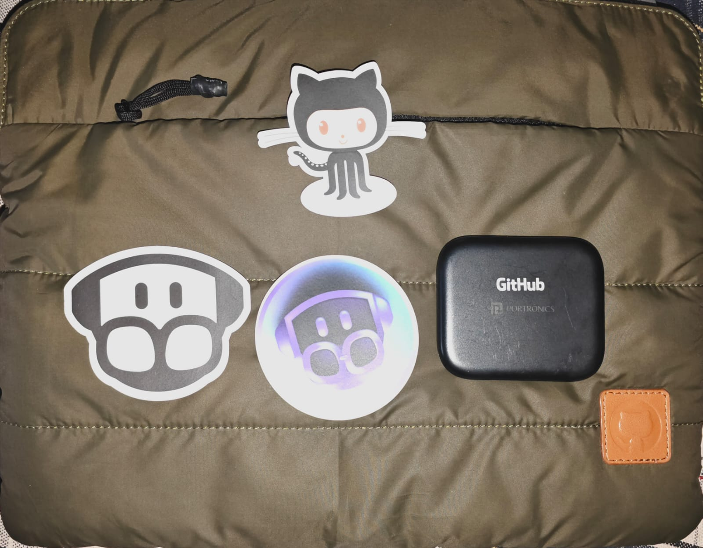
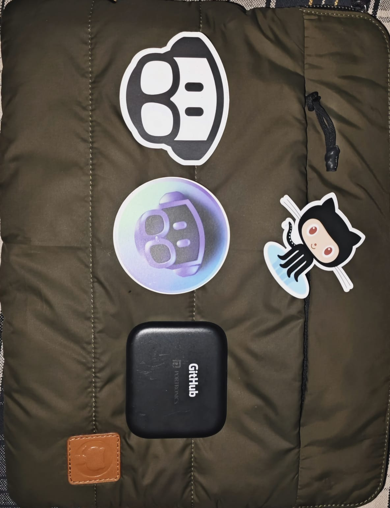
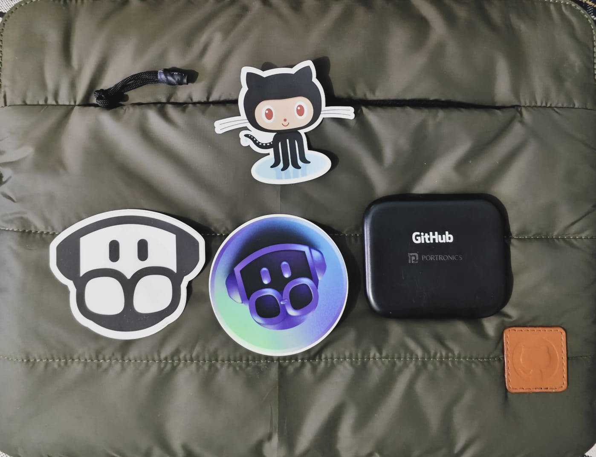
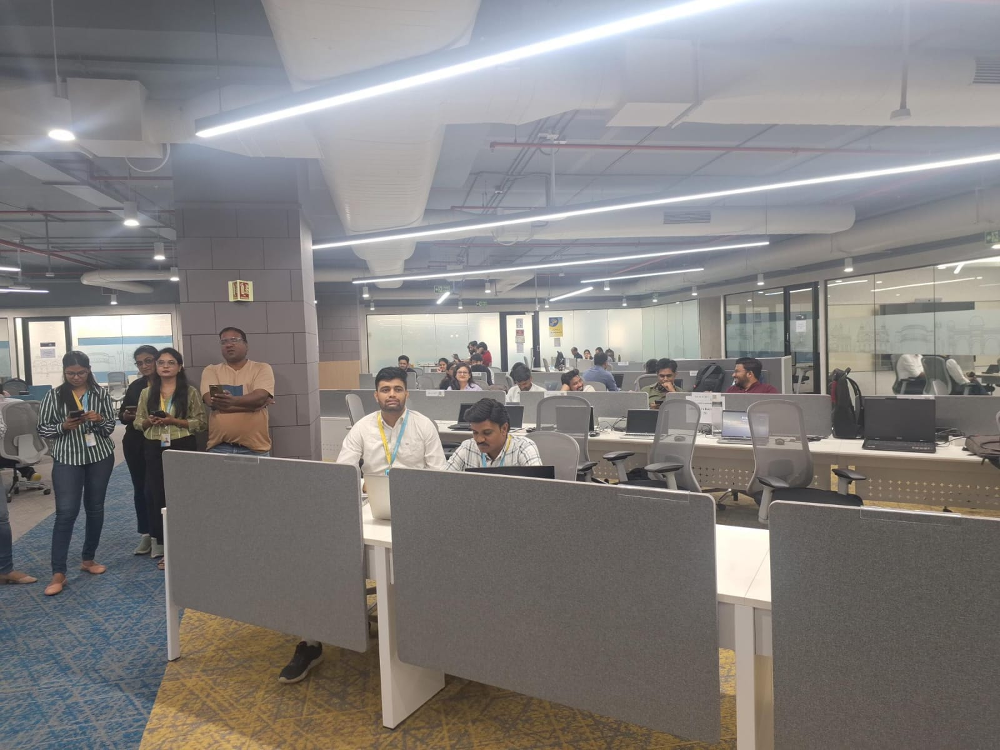
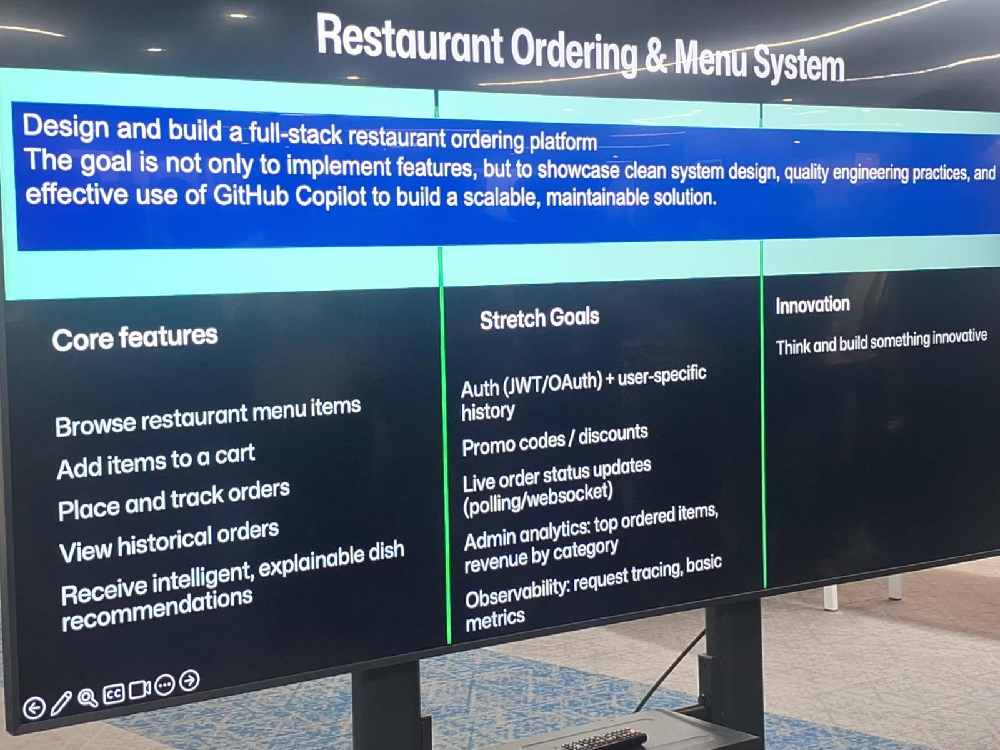
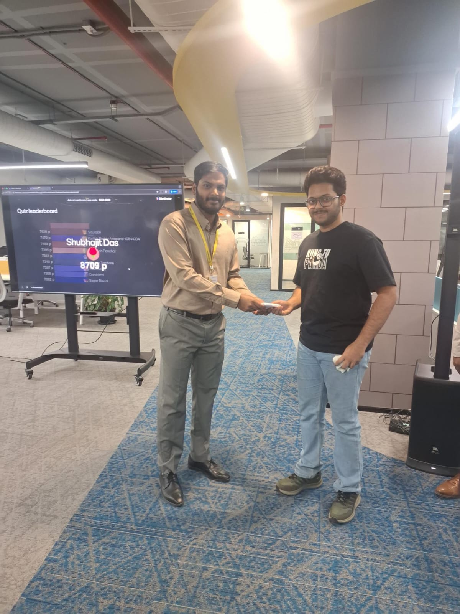
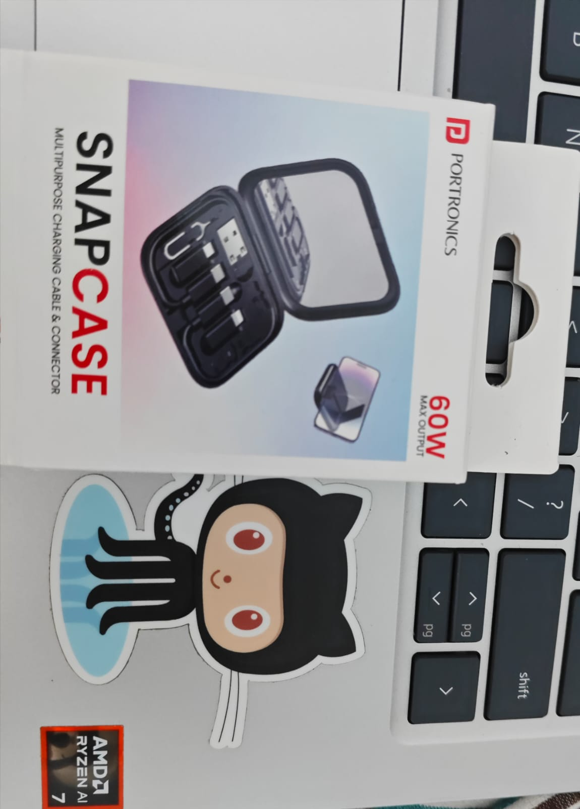

# GitHub Copilot Hackathon – LTM Pune

A collection of proof and achievements from the **GitHub Copilot Hackathon at LTM Pune**.

## 🏆 Achievement

- Participated in the **GitHub Copilot Hackathon – LTM Pune**
- Achieved a **Top 10 position on the leaderboard**
- Collaborated as part of an **all-freshers team**
- Designed and developed a **Restaurant Ordering & Menu System** under time constraints

## 💻 Project

### Restaurant Ordering & Menu System

A full-stack application developed during the hackathon to demonstrate a practical restaurant ordering and menu management workflow.

## 👥 Team

**All-freshers team**

## 🛠️ Technologies

**Java · Spring Boot · React · AWS**

## 📜 Proof / Certificate

[View Certificate](./certificate.pdf)

## 📸 Hackathon Photos

<table>
  <tr>
    <td></td>
    <td></td>
    <td></td>
  </tr>
  <tr>
    <td></td>
    <td></td>
    <td></td>
  </tr>
  <tr>
    <td></td>
    <td></td>
    <td></td>
  </tr>
</table>

---

### 🔗 Verification

This repository contains supporting proof, photographs, and documentation related to my participation in the **GitHub Copilot Hackathon – LTM Pune**.
